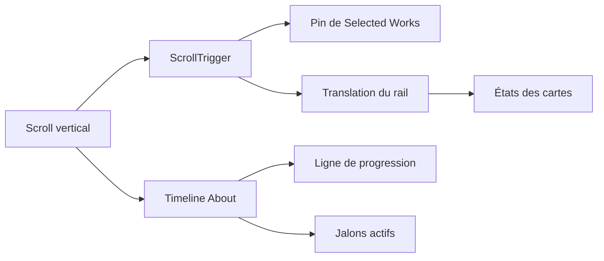

# Requirements

### Objectif
Créer, avant toute modification validée, une expérience GSAP inspirée des présentations de projets horizontales : sur ordinateur, le scroll vertical traverse horizontalement les projets de `index.html` avec des animations par carte. Enrichir également `Academic & Technical Timeline` de `About.html`.

### Périmètre
- Transformer uniquement `#Selectedworks` de `index.html` ; `Work.html` conserve sa grille, ses filtres et ses modales.
- Épingler la vitrine des trois `.editorial-work-card` sur les écrans larges et associer sa progression au scroll.
- Animer l’entrée, la mise en avant et la sortie de chaque projet sans empêcher ses liens `data-project-trigger` ni le lien Figma.
- Sous `992px`, désactiver l’épinglage et conserver le flux vertical existant, conforme au comportement responsive actuel.
- Recomposer les jalons de `About.html` selon la structure attendue par `css/about.css`, puis animer une progression de timeline et l’apparition des cartes.

### Critères d’acceptation
- Le défilement de la section projets est fluide, sans scrollbar horizontale visible ni décalage de mise en page.
- Chaque projet reçoit une animation distincte synchronisée à son passage à l’écran.
- Le redimensionnement, le thème, le préchargeur, le modal et les liens existants continuent de fonctionner.
- La timeline affiche une ligne remplie progressivement et des jalons visuellement actifs au passage des cartes.
- Les utilisateurs avec `prefers-reduced-motion: reduce` obtiennent un rendu statique lisible.

# Technical Design

### État actuel
- `index.html` (lignes 150–319) contient la vitrine `#Selectedworks` avec trois `.editorial-work-card` dans `.editorial-works-container` ; elles utilisent leurs boutons de modal existants.
- `css/projects.css` définit actuellement ce conteneur en colonne (lignes 116–120) et les cartes en grille média/contenu (lignes 122–136).
- `js/main.js` enregistre déjà `ScrollTrigger` (lignes 405–411) mais applique un reveal vertical générique aux `.editorial-work-card` et `.project-card` (lignes 423–438).
- `About.html` (lignes 213–239+) fournit directement des `.timeline-card`, alors que `css/about.css` (lignes 161–192) et `js/main.js` (lignes 455–468) attendent des `.timeline-item` et `.timeline-dot` ; l’animation existante ne peut donc pas s’appliquer à ces jalons.
- `css/responsive.css` transforme déjà les cartes éditoriales en colonne à `992px` (lignes 31–56), seuil qui servira de repli sans pinning.

### Changements proposés
- Dans `index.html`, ajouter des hooks sémantiques dédiés pour une piste horizontale et ses panneaux, sans changer le contenu ni les liens de chaque projet.
- Dans `css/projects.css`, définir le mode desktop de la piste horizontale : largeur de panneau contrôlée, débordement masqué, hauteur stable pendant le pinning et états visuels ciblables par carte. Les styles verticaux courants resteront le fallback.
- Dans `css/responsive.css`, neutraliser explicitement les dimensions/transforms propres à l’expérience horizontale à `992px` et moins.
- Dans `js/main.js`, isoler l’effet dans `initHorizontalProjects()` appelé depuis `initGSAPAnimations()` seulement si `ScrollTrigger` est disponible et que le breakpoint desktop correspond. Un `gsap.matchMedia()` créera et nettoiera le `ScrollTrigger` à chaque changement de breakpoint.
- La timeline GSAP traduira la progression de scroll en largeur/échelle de sa ligne et déclenchera les états actifs/reveals par jalon. Les anciens reveals génériques seront exclus des éléments désormais animés par cette logique dédiée afin d’éviter les conflits.
- Ajouter une garde `prefers-reduced-motion` qui ne crée pas de `pin`, de scrub ni de reveal transformé ; le contenu reste entièrement visible.

### Flux d’animation

### Risques et protections
- La longueur de défilement sera calculée depuis la largeur réellement scrollable du rail, puis recalculée par `ScrollTrigger.refresh()` après chargement/redimensionnement.
- Le sélecteur générique actuel des cartes sera séparé de la vitrine horizontale, évitant deux animations sur les mêmes éléments.
- Aucun plugin GSAP supplémentaire ni dépendance externe ne sera ajouté : `gsap` et `ScrollTrigger` 3.12.5 sont déjà chargés sur les pages concernées.

# Testing

### Validation
- Vérifier sur desktop que les trois projets traversent l’écran horizontalement, que la section se libère à la fin du dernier projet et qu’aucun débordement horizontal ne survient.
- Vérifier les états d’entrée, de focus et de sortie des cartes, puis ouvrir les modales et liens existants pendant/après la séquence.
- Vérifier à `992px` et moins que les projets reviennent à leur empilement vertical, sans espace de pinning ni translation résiduelle.
- Vérifier la timeline desktop/mobile : progression de ligne, activation successive des points, visibilité des trois jalons existants et absence de conflits avec le reveal précédent.
- Vérifier le thème clair/sombre, le redimensionnement et `prefers-reduced-motion: reduce`.

# Delivery Steps

### ✓ Step 1: Préparer la structure et le rendu responsive de la vitrine
La section `Selected Works` possède les hooks et styles nécessaires à un rail horizontal desktop, tout en restant verticale sous `992px`.
- Modifier `index.html` pour identifier le viewport, le rail et les panneaux de projet sans modifier leurs contenus, liens Figma ou déclencheurs de modal.
- Étendre `css/projects.css` avec les dimensions, débordements et états visuels du rail horizontal sur desktop.
- Ajouter dans `css/responsive.css` le repli explicite à une colonne et la suppression des contraintes de rail/pinning pour tablette et mobile.

### ✓ Step 2: Implémenter le parcours horizontal GSAP des projets
Le scroll vertical pilote de façon fluide la traversée horizontale des projets sur les écrans larges.
- Ajouter `initHorizontalProjects()` dans `js/main.js` et l’intégrer à `initGSAPAnimations()`.
- Utiliser `gsap.matchMedia()` et `ScrollTrigger` pour épingler la section, calculer la distance depuis le rail et l’animer avec `scrub`.
- Ajouter les animations synchronisées de chaque panneau et retirer ces panneaux du reveal vertical générique afin d’éviter les doubles transformations.
- Prévoir le nettoyage des triggers à la sortie du breakpoint et le fallback statique pour `prefers-reduced-motion`.

### ✓ Step 3: Recomposer et animer la timeline académique
La timeline d’`About.html` révèle chaque étape avec une ligne de progression et des jalons actifs.
- Modifier le markup de `About.html` pour envelopper chaque `.timeline-card` dans `.timeline-item` et lui associer `.timeline-dot`, conformément à `css/about.css`.
- Compléter `css/about.css` avec une ligne de progression dédiée et les styles d’état actif des points et cartes.
- Remplacer le reveal `.timeline-item` actuel de `js/main.js` par une séquence GSAP coordonnée : remplissage progressif de la ligne, apparition des jalons et activation à l’entrée dans le viewport.
- Appliquer le même repli accessible sans mouvement réduit.

### ✓ Step 4: Valider les interactions et les régressions visuelles
Les deux animations fonctionnent sur les tailles d’écran et modes d’affichage pris en charge sans casser les interactions existantes.
- Contrôler le parcours horizontal, la sortie de pinning et l’absence de débordement sur desktop.
- Contrôler le repli vertical à `992px` et moins, les liens de projet et les modales existantes.
- Contrôler la progression complète des quatre jalons, les thèmes clair/sombre, le redimensionnement et `prefers-reduced-motion`.